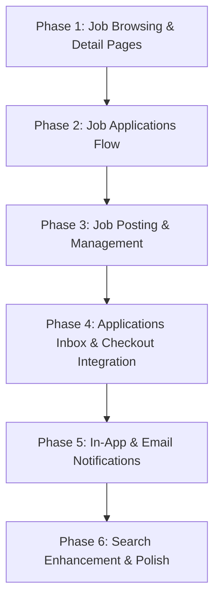

# Project Implementation Roadmap & Tasks

This document outlines the priority tasks required to complete the JobBoard application, ordered logically from core blockers to advanced features, including the step-by-step technical implementation path for each task.

---

## 📋 Implementation Order Priority

To ensure the team is unblocked and features can be tested end-to-end, implement the remaining features in the following sequence:



---

## 🛠️ Detailed Implementation Guide

### Phase 1: Job Browsing & Detail Pages (Blocker Task)
*Without a way to browse and view jobs, the core candidate experience is blocked.*

#### 1. Backend Verification
The backend `JobController` is already fully functional.
* Route: `GET /api/v1/jobs` (list/search) and `GET /api/v1/jobs/{jobListing}` (show detail).
* **Action:** Ensure these endpoints return correct category and employer profile relationships.

#### 2. Frontend Implementation
* **Create Job Feed View:** Create `client/src/views/JobsView.vue`. It should query `GET /api/v1/jobs` with optional query parameters for filtering (`category_id`, `work_type`, `salary_min`, `location`).
* **Create Job Details View:** Create `client/src/views/JobDetailView.vue`. It should display full description, requirements, benefits, and company profile.
* **Update Router:** Register these views in `client/src/router/index.ts`:
  * `/jobs` (public feed)
  * `/jobs/:id` (public detail)

---

### Phase 2: Job Applications Flow
*Enables candidates to apply for job listings.*

#### 1. Backend Implementation
* **Create Application Controller:** Create `App\Http\Controllers\Api\ApplicationController.php` with:
  * `store(Request $request, JobListing $jobListing)`: Validate candidate role, check if they already applied, save upload resume (to S3/local), and create `Application` record.
  * `index(Request $request)`: Return paginated applications submitted by the logged-in candidate.
  * `cancel(Application $application)`: Soft-delete/cancel a candidate's application.
* **Register Routes:** Add endpoints in `server/routes/api.php` under `auth:sanctum` middleware:
  ```php
  Route::post('/jobs/{jobListing}/apply', [ApplicationController::class, 'store']);
  Route::get('/my-applications', [ApplicationController::class, 'index']);
  Route::delete('/applications/{application}', [ApplicationController::class, 'cancel']);
  ```

#### 2. Frontend Implementation
* **Create Apply Modal:** Implement a reusable modal component `client/src/components/candidate/ApplyModal.vue` with file input for Resumes and a textarea for the cover letter. Include it on the Job Detail view.
* **Create Applications History Page:** Implement `client/src/views/Candidate/ApplicationsView.vue` and link it to `/candidate/applications` in the router. Make it consume the `GET /api/v1/my-applications` endpoint.

---

### Phase 3: Job Posting & Management
*Allows employers to publish jobs for candidates to view.*

#### 1. Backend Verification
The backend `EmployerJobController` is ready with standard CRUD.
* Routes: `POST /api/v1/employer/jobs` (store), `PUT /api/v1/employer/jobs/{job}` (update).

#### 2. Frontend Implementation
* **Create Job Form View:** Create `client/src/views/Employee/JobFormView.vue`. It should handle both creating and editing a listing. Include all fields (Title, Description, Requirements, Benefits, Location, Salary Min/Max, Work Type, Category, Deadline).
* **Update Router:** Register the routes:
  * `/employer/jobs/create` -> `JobFormView.vue`
  * `/employer/jobs/:id/edit` -> `JobFormView.vue`
* **Wire actions:** Bind the edit/delete/close actions inside the main Employer Dashboard listings list to call backend endpoints.

---

### Phase 4: Applications Inbox & Checkout Integration
*Links job applications to payments and unlocks candidate contact details.*

#### 1. Backend Implementation
* **Create Application Status Controller:** Create endpoints to allow employers to manage incoming applications.
  * `accept(Application $application)`: Updates status to `accepted`.
  * `reject(Application $application)`: Updates status to `rejected`.
* **Align Payments Table API:** The current `EmployerPaymentController` relies on `job_id` and `candidate_id` directly. To align with the frontend checkout views, implement:
  * `GET /api/v1/applications/{application}/checkout`: Retrieve application pricing details.
  * `POST /api/v1/payments/stripe`: Create Stripe payment intent for the application.
  * `POST /api/v1/payments/paypal`: Create PayPal order for the application.
  * `GET /api/v1/applications/{application}/contact`: Returns candidate's contact details *only if* there is a payment matching the `application_id` with a status of `paid`.

#### 2. Frontend Integration
* **Create Applications Inbox:** Create `client/src/views/Employee/ApplicationsInboxView.vue` (mapped to `/employer/applications` in the router) for employers to view candidates who applied to their jobs, with **Accept** and **Reject** buttons.
* **Integrate Checkout Button:** Clicking **Accept** should flag the application, and if accepted, show an **Unlock Contact** button. Clicking it redirects the employer to `/payment/checkout/:applicationId` (using the checkout pages built by Fathy).

---

### Phase 5: In-App & Email Notifications
*Keeps users updated on their application status and system actions.*

#### 1. Backend Implementation
* **Create Notification Controller:** Create `App\Http\Controllers\Api\NotificationController.php` with:
  * `index(Request $request)`: Fetch all database notifications for the logged-in user.
  * `markAsRead(Request $request, $id)`: Mark specific notification as read.
  * `markAllAsRead(Request $request)`: Mark all notifications as read.
* **Trigger Notifications:** Dispatch `JobStatusChanged` and `UserStatusChanged` events/notifications from the controllers during status transition flows (e.g., when an admin approves a job, or an employer accepts/rejects a candidate).

#### 2. Frontend Implementation
* **Create Notifications List View:** Populate the existing placeholder views:
  * `client/src/views/Candidate/NotificationsView.vue`
  * `client/src/views/Employee/NotificationsView.vue`
* **Create Notification Dropdown/Badge:** Add a notification dropdown list directly to the navigation header layout showing unread count and preview descriptions.

---

### Phase 6: Search Enhancement & Polish
*Advanced filters, Meilisearch index sync, and S3 storage config.*

#### 1. Meilisearch Synced Indexing
* Ensure Meilisearch server configuration is set up under `.env` (`SCOUT_DRIVER=meilisearch`).
* Run the sync command to index existing jobs:
  ```bash
  php artisan scout:import "App\Models\JobListing"
  ```

#### 2. Configure S3 File Uploads
* In `config/filesystems.php`, verify S3 driver configuration.
* Change uploads in `UserController.php` and `ApplicationController.php` from `public` to `s3` storage disk to store logos, avatars, and resumes in the cloud.
* Set the environment variables in `.env`:
  ```env
  FILESYSTEM_DISK=s3
  AWS_ACCESS_KEY_ID=your-key
  AWS_SECRET_ACCESS_KEY=your-secret
  AWS_DEFAULT_REGION=us-east-1
  AWS_BUCKET=jobboard-bucket
  ```
